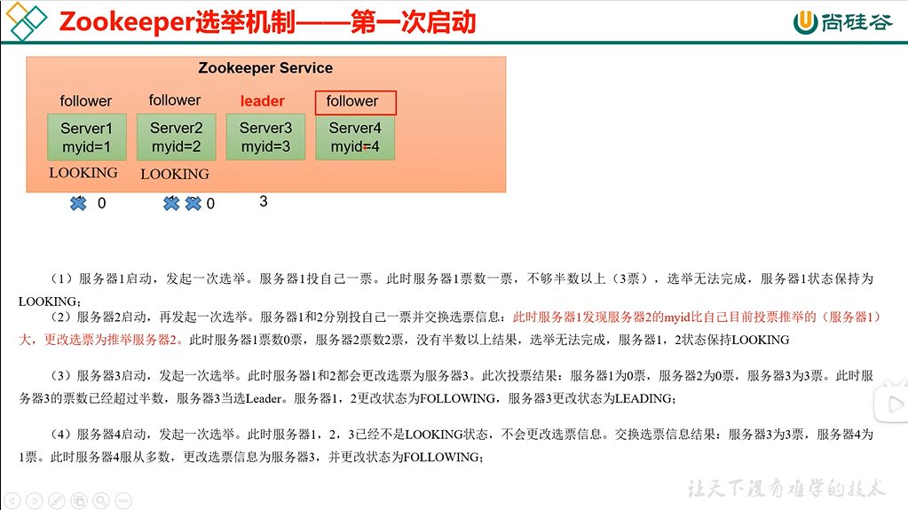
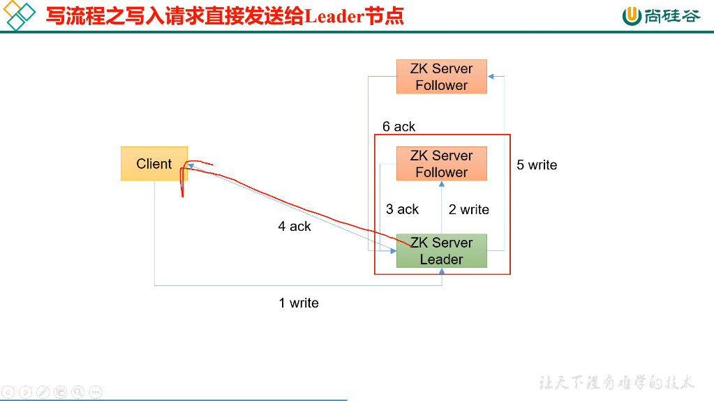
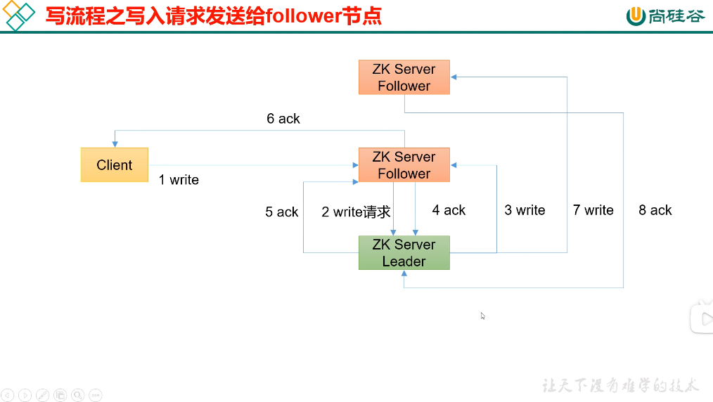

## Zookeeper学习笔记
本示例的学习内容来自B站视频：[【尚硅谷】大数据技术之Zookeeper 3.5.7版本教程](https://www.bilibili.com/video/BV1to4y1C7gw)

### Zookeeper 应用场景
1. 统一命名服务
2. 统一配置管理
3. 统一集群管理
4. 服务器节点动态上下线
5. 软负载均衡

### Zookeeper 选举机制
  面试题重点！
  Zookeeper采用半数选举原则。
#### 第一次启动
投票过半数，服务器id大的胜出

zookeeper集群在启动时，每个实例会依次注册到集群。
1. 每个实例先给自己投一票
2. 然后每个实例注册到集群后，依次与以注册的实例比较myid，myid大的获得选票
3. 集群中第一个获得半数以上的实例，成为集群的leader，其他的自动变成follower
4. 集群的leader一旦产生，启动过程中其他集群获得再多的选票，也不会把leader让出去了

#### 第二次以后启动
1. EPOCH大的为leader
2. EPOCH相同，事务id大的为leader
3. 事务id相同，服务器id大的为leader

### Zookeeper 写原理
依然是半数原则，不过类似mysql的读写分离，follower是没有写权限的，只有leader有
#### 写入leader

1. 客户端把数据写入leader
2. leader把数据同步到follower，等待follower返回ack应答
3. 有半数以上的节点写入完毕，也就是一半的follower都ack了，响应客户端写入成功
4. 剩下没写入的follower继续进行写入

#### 写入follower

1. 客户端发送写请求到follower，follower没有权限，于是转发给了leader
2. leader收到转发请求，开始让follower写入
3. 半数follower写入完成，应答ack后，给转发写请求的follower返回ack
4. 接收到ack的follower响应客户端写入成功
5. 剩下没写入的follower继续进行写入

### Zookeeper 部署多少合适
安装奇数台zookeeper
生产中的经验：
1. 10台服务器：3 zk
2. 20台服务器：5 zk
3. 100台服务器：11 zk
4. 200台服务器：11 zk

服务器台数多，会提高可靠性，但是也会提高通信延迟

### Zookeeper怎么保持数据一致性

#### Paxos算法
一种基于消息传递且具有高度容错特性的一致性算法。Paxos算法将所有节点划分为3类：
1. Proposer（提议者）
2. Acceptor（接收者）
3. Learner（学习者）
每个节点都可以身兼数职

Paxos算法分为3个阶段：
1. Prepare：承诺阶段
2. Promise：提案阶段
3. Propose：执行阶段

但是Paxos会有活锁问题，2个以上的Proposer无限抢占Acceptor导致无法达成一致

#### ZAB协议
ZAB包括2部分，事务广播，奔溃恢复
##### 1、事务广播
类似于Mysql的2阶段提交
1. Leader通过FIFO队列向所有Follower发送写请求提案(Propose)
2. Follower收到提案后，将消息写入事务日志，然后给Leader返回ack
3. Leader收到半数以上的Follower的ack后认为消息发送成功，给所有follower发送commit消息，并且自身也提交事务
4. Follower收到commit消息后，将事务进行提交
##### 2、奔溃恢复
###### 假设2种服务器异常：

1) 假设一个事务在Leader提出后，Leader挂了
2) 一个事务Leader上提交了，并且过半Follower都ack了，但是Leader在commit发出前后挂了

###### ZAB协议奔溃回复要求满足2个要求：

1) 确保Leader提交的提案，确保所有Follower都提交
2) 确保丢弃已经被Leader提出，但没有commit的提案

###### 如果Leader奔溃了，选举Leader需要满足以下条件
1) 新选举的Follower必须没有未提交的提案
2) 新选举的Follower选事务Id最大的

###### ZAB协议怎么完成工作
1) 完成选举后，在开始工作前，Leader会先确认是否有过半的Follower同步了最新的提案
2) Follower必须将提案同步完成后，才会被Leader加入到可用的Follower列表
